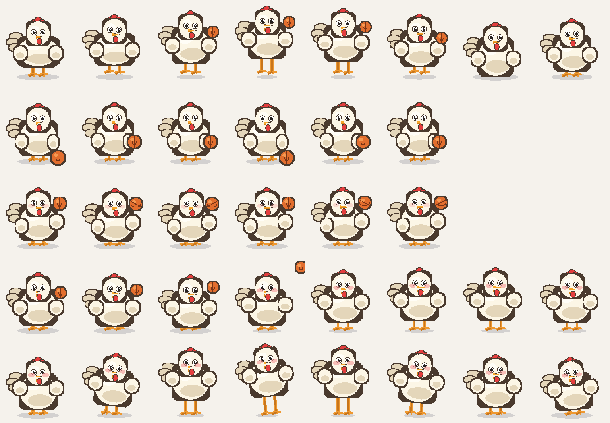
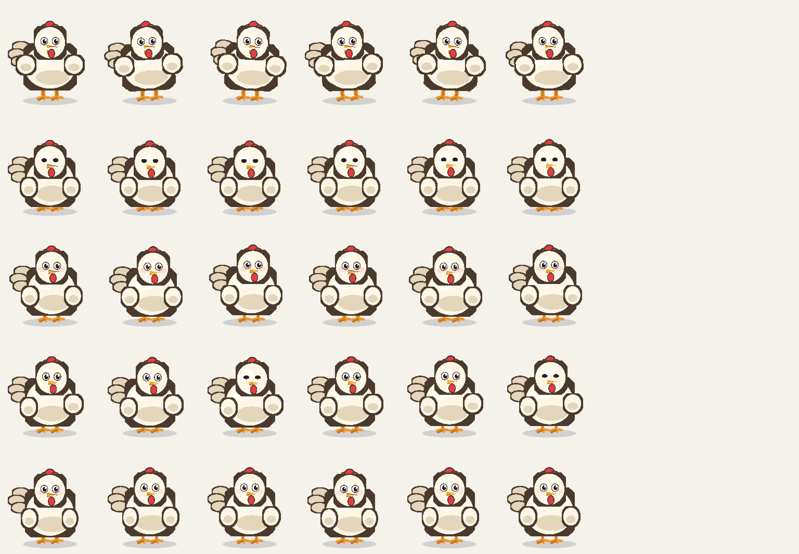

# 🐔 dsh-chicken-pet

> 一只住在 [DeepSeek Harness](https://github.com/deepseek-ai/deepseek-harness) Web 界面里的原创像素鸡。
> 你干活的时候它搬砖，你思考的时候它托腮，等你回复的时候它翘首以盼——
> **而它闲下来的时候会自己找事做**：打盹、踱步、啄米、抖毛、转球、投篮。

<p align="center">
  
</p>

---

## 它和别的桌宠有什么不一样

这个品类已经很热闹了，头部项目在「动画数量」和「养成系统」上做得很深。这只鸡选了另一条路：**把功夫花在「自主行为」上**。

大多数桌宠的待机是**一个循环动画**播到天荒地老。这只鸡不是——它有一套**行为调度器**：每隔几秒掷一次加权骰子，从 10 种待机行为里抽一个来演。

也就是说，**你不理它，它也在自己玩**。

| 待机时它会…… | 权重 | 台词 |
|---|---|---|
| 站着发呆 | 26 | — |
| 左右张望 | 16 | ？ |
| 低头啄米 | 14 | 咕咕… |
| 抖抖羽毛 | 11 | 抖抖毛~ |
| 来回踱步 | 10 | 溜达溜达 |
| 扑棱翅膀 | 8 | 扑棱扑棱 |
| 打盹 | 7 | Zzz… |
| 指尖转球 🏀 | 5 | 看我转球！ |
| 原地运球 🏀 | 4 | 运球中… |
| 挥手打招呼 | 3 | 嘿~ |

「活跃度」可以在配置里调：0 就是一只安静的鸡，1 就是一刻不停的鸡。

---

## 全部 20 个动作

素材是**程序化生成的原创像素画**，不是任何现有形象的二创。20 行动画、每行最多 8 帧，全部由代码画出（`scripts/chicken.mjs`）。

| 分类 | 动作 |
|---|---|
| **待机** | `idle` 呼吸眨眼 · `look` 张望 · `peck` 啄米 · `ruffle` 抖毛 · `pace` 踱步 · `sleep` 打盹 · `flap` 扑棱 |
| **篮球** | `dribble` 运球 · `spin-ball` 指尖转球 · `shoot` 投篮 · `celebrate` 庆祝 |
| **工作** | `work` 搬砖 · `think` 思考 · `wait` 等待 · `sad` 低落 |
| **互动** | `wave` 挥手 · `startle` 惊吓 · `jump` 跳跃 · `walk-right` / `walk-left` 走路 |

<p align="center">
  
</p>

---

## 它怎么跟着 Agent 的状态走

| Agent 发生了什么 | 鸡的反应 | 气泡 |
|---|---|---|
| 有工具在执行 | 搬砖 | 搬砖中… |
| 工具跑完了 | 思考 | 想想… |
| 等待审批 / 提问 | 翘首以盼 | 等你哦~ |
| **AI 说完一句回答** | 挥手 + **咕咕叫** | 咕咕！ |
| 一个回合干净结束 | 投篮庆祝 🏀 | 好球！ |
| 请求出错 | 蔫了 | 呜…出错了 |
| 你戳它一下 | 吓一跳 + 叫 | 干嘛~ |
| 你拖着它走 | 跟着跑 | — |

**注意「AI 说完一句回答」这一行。**

多数桌宠只在**整个任务结束**时才有反应。这只鸡监听的是 `agent/assistant-stream` 的提交帧——也就是**模型每答完一段**就回应一次。多步任务里它会陪你一路咕咕叫。

（防抖 6 秒，所以一个连续的多步回合不会变成噪音。）

---

## 安装

```sh
# 从 GitHub 安装
dsh plugin --profile web add "github:<你的用户名>/dsh-chicken-pet#main"

# 或从本地目录安装（开发时用）
dsh plugin --profile web add /path/to/dsh-chicken-pet
```

装完**重启 `dsh web`**（bundle 层在启动时组合），右下角就会出现这只鸡。

---

## 配置

改 `$DSH_HOME/profiles/web/cordis.patch.yml`，按 id 覆盖这一行的配置：

```yaml
- id: chicken-pet
  config:
    corner: bottom-right   # top-left | top-right | bottom-left | bottom-right
    marginX: 24            # 距角落的水平边距（px）
    marginY: 24            # 距角落的垂直边距（px）
    size: 128              # 渲染宽度（px），高度按 192:208 自动算
    sound: true            # AI 答完时是否叫一声
    volume: 0.85           # 音量 0-1
    idleMinSec: 4          # 两次自主行为之间最短间隔（秒）
    idleMaxSec: 12         # 最长间隔（秒）
    liveliness: 0.75       # 活跃度 0-1：越高越闲不住
    enabled: true          # 关掉就不显示
```

**想让鸡安静一点**：`liveliness: 0.2`、`idleMinSec: 15`。
**想要一只多动症鸡**：`liveliness: 1`、`idleMinSec: 2`、`idleMaxSec: 5`。

---

## 关于声音

**没有使用任何第三方音频素材。**

「咕咕」是浏览器用 Web Audio 现场合成的双音啁啾（`OscillatorNode`），所以：

- 不打包任何音频文件，插件体积只有 sprite 的 ~170KB
- 没有版权问题，可以放心商用
- 首次交互前浏览器会拦截自动播放——这是浏览器策略，正常现象

---

## 素材版权

**全部原创，零版权风险。**

- `assets/spritesheet.png` 由 `scripts/build-sprites.mjs` **逐像素程序化生成**，不是截图、不是二创、不是任何现有形象的衍生。鸡的造型（奶白身体、红冠、橙喙、肉垂、橙色篮球）是原创设计。
- 声音是运行时合成的，不涉及任何采样。
- 代码 MIT。

所以这个仓库可以随意 fork、修改、商用。想换成别的形象？改 `scripts/chicken.mjs` 里的调色板和几何参数，重跑 `npm run sprites` 就行。

---

## 项目结构

```
dsh-chicken-pet/
├── src/
│   ├── index.ts            # bundle 包入口（无运行时代码，本体是 cordis.patch.yml）
│   ├── host/index.ts       # Host 半：注册精灵图 HTTP 路由（带内容哈希缓存）
│   └── client/
│       ├── index.ts        # Client 半：DOM 渲染、拖动、点击、事件订阅、音效
│       ├── brain.ts        # 自主行为引擎（纯状态机，零 DOM 依赖，可单独测试）
│       └── sheet.ts        # 精灵图几何与帧时长表
├── scripts/
│   ├── png.mjs             # 零依赖 PNG 编码器 + 软件光栅器
│   ├── chicken.mjs         # 像素鸡的解剖结构（参数化绘制）
│   ├── animations.mjs      # 20 行动画的姿势函数
│   ├── build-sprites.mjs   # 生成 assets/spritesheet.png
│   ├── build-plugin.mjs    # 用 tsc 编译到 lib/
│   └── preview.mjs         # 渲染预览图到 docs/
├── assets/                 # spritesheet.png（生成物，已入库）
├── demo/index.html         # 独立演示页，不需要 DSH
└── cordis.patch.yml        # bundle 补丁：插入 chicken-pet 行
```

### 开发

```sh
npm install
npm run sprites     # 重新生成精灵图
npm run build       # 编译到 lib/
npm run typecheck   # 用真实 DSH 源码做类型检查
npx serve .         # 然后打开 /demo/index.html
```

演示页不依赖 DSH，可以直接调活跃度、模拟各种 Agent 事件、看全部 20 个动作。

---

## 技术说明

**为什么要 Host 半？** 浏览器插件读不到包目录里的文件，精灵图必须由 Host 注册一条 HTTP 路由。路由 URL 带内容哈希 + `immutable` 缓存头，升级插件后刷新即生效，不会吃到旧图。

**为什么用 DOM 而不是 React？** 桌宠是一块浮在界面上的独立元素，不需要参与 dsh 的 Slot 布局系统。用裸 DOM 让它不依赖任何 React 版本、也不占用布局槽位——只有精灵本身接收指针事件，不会挡住后面的聊天。

**为什么事件和轮询都用？** 事件是准确来源，立刻送达。但社区实践中出现过「事件在某个部署的总线上送不到插件」的情况，所以还有一路 700ms 轮询 `ctx.agents` 兜底，避免鸡永远卡在搬砖姿势。

**自主行为引擎是纯的。** `ChickenBrain` 不碰 DOM、不碰计时器实现（时钟可注入），所以能脱离浏览器测试。`liveliness` 是作用在权重上的过滤器而不是独立掷硬币——后者会让高活跃度照样经常发呆，实测下来动作频率和设置对不上。

---

## License

代码 [MIT](LICENSE)。素材（`assets/spritesheet.png`）同样是本项目生成的原创作品，随 MIT 一并授权。
